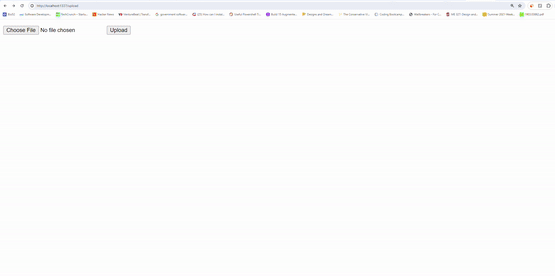

This repo contains code for containerizing a Flask application with Postgres for development. It also contains production-ready setup with Gunicorn and Nginx. The website could be launched locally and allows users to upload media files and display static files. See below for the resulting website and instructions on how to use this setup.



Create and add your login to `.env.prod`. It should have the following fields
```
FLASK_APP=
FLASK_DEBUG=
DATABASE_URL=
SQL_HST=
SQL_PORT=
DATABASE=
```
Also create `.env.prod.db`. It should have the following fields
```
POSTGRES_USER=
POSTGRES_PASSWORD=
POSTGRES_DB=
```

For Launching Web Page (Development):
`docker-compose up -d --build`

This command builds and starts the containers in detached mode. After running this, the website should be accessible at http://localhost:1340/. It's ideal for development purposes as it utilizes the default docker-compose.yml file.
Accessing PostgreSQL:

`$ docker-compose exec web python manage.py create_db`
This command initializes the database by running the `create_db` script within the web container. It sets up the necessary tables and structures in the PostgreSQL database.
`$ docker-compose exec db psql --username=hello_flask`
This allows you to connect to the PostgreSQL database using the `psql` command line interface. Replace `hello_flask` with the appropriate username.
For Launching Web Page (Production):
`$ docker-compose -f docker-compose.prod.yml down -v`

This command stops and removes containers, networks, volumes, and images created by up in production mode. The `-v` flag ensures that the associated volumes are also removed.
`$ docker-compose -f docker-compose.prod.yml up -d --build`

Similar to the development command, this builds and starts the containers in detached mode but specifically for the production environment. It uses the `docker-compose.prod.yml` file for configuration.
`$ docker-compose -f docker-compose.prod.yml exec web python manage.py create_db`

This initializes the database in the production environment, similar to the development setup.
After running these commands, the website should be accessible at http://localhost:1339/ in the production environment.

You can check the logs via `docker-compose logs -f`

